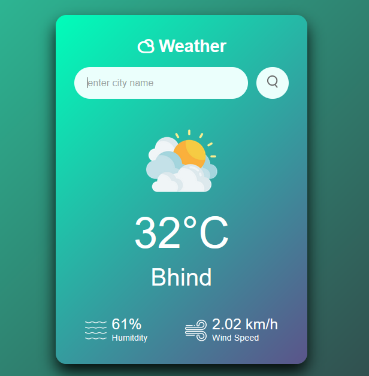

# 🌦️ Weather App

This is a simple, clean, and attractive weather app built using **HTML, CSS, and JavaScript**.  
It uses the **OpenWeatherMap API** to fetch live weather data for any city you search.

---

## ✨ Features

- Search weather by city name
- Shows temperature, humidity, and wind speed
- Displays weather icon dynamically
- Responsive and modern UI

---

## 💻 Screenshot

---

## 🚀 How to Use

1️⃣ Clone or download this repository.  
2️⃣ Open `index.html` in your browser.  
3️⃣ Enter any city name and click the search button or press Enter.  
4️⃣ See live weather updates instantly.

---

## 🌐 API Used

- [OpenWeatherMap API](https://openweathermap.org/api)

---

## ⚡ Author

- **Parul Gupta**  
- [GitHub](https://github.com/Parul-Guptaa)

---

⭐ If you like this project, feel free to star ⭐ the repo and share!
# weather-app
